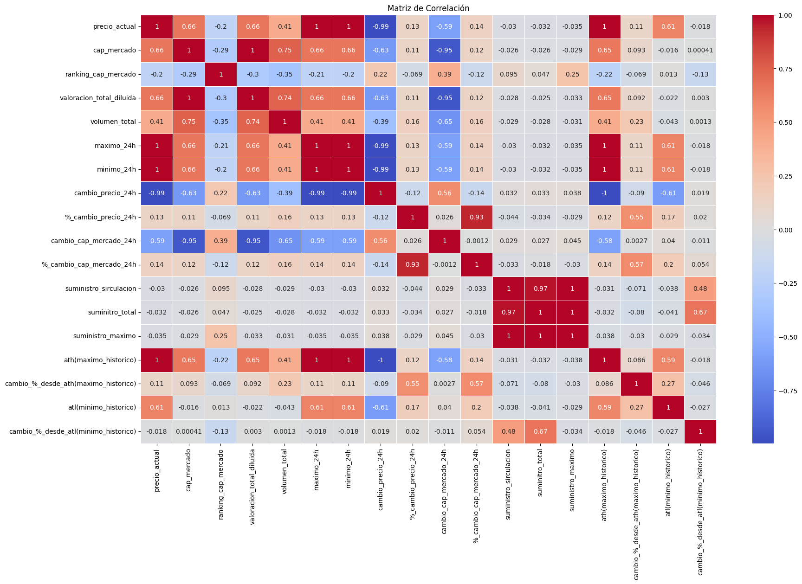
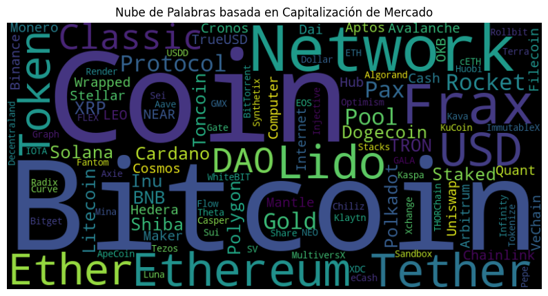
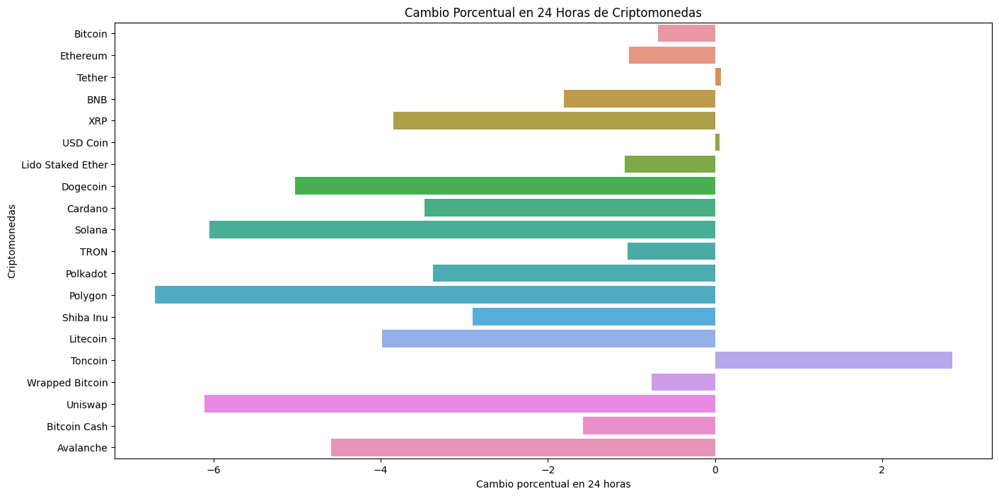

# PIDA2_criptomonedas# Análisis del Mercado de Criptomonedas - Proyecto de Data Analysis
 ### Proyecto Presentado por: Mateo Betancourt H.
## Introducción

¡Bienvenidos al proyecto de Análisis del Mercado de Criptomonedas! En este repositorio, encontrarás un análisis exhaustivo del emocionante mundo de las criptomonedas. Como Analista de Datos en una empresa de servicios financieros, me embarqué en un viaje para explorar, entender y extraer información valiosa de este mercado en constante evolución.

## Objetivo del Proyecto

El propósito de este proyecto es arrojar luz sobre el fascinante mundo de las criptomonedas, comprender su comportamiento y proporcionar información clave para la toma de decisiones informadas en inversiones y estrategias financieras. A través de un análisis detallado y visualizaciones interactivas, este proyecto busca facilitar la comprensión del mercado de criptomonedas.

## Contenido del Repositorio

En este repositorio, encontrarás:

- **Código ETL y EDA:** Explora cómo se realizó la Extracción, Transformación y Carga (ETL) de los datos de la API CoinGecko y el Análisis Exploratorio de Datos (EDA) para descubrir patrones y tendencias.

- **Informe Detallado:** El informe detalla los hallazgos clave, los pasos del análisis y las visualizaciones generadas. Se describe el proceso y las decisiones tomadas para comprender mejor el mercado.

- **Power BI Dashboard:** Descubre un análisis interactivo en el dashboard de Power BI. Desde una visión general hasta detalles específicos, las visualizaciones te permitirán explorar el mercado de criptomonedas y sus tendencias.

- **Medidas KPI:** Se han incorporado medidas clave de rendimiento (KPIs) en el análisis para identificar oportunidades y tendencias en el mercado.

## Power BI Dashboard

El corazón de este proyecto es el dashboard de Power BI. Aquí encontrarás visualizaciones interactivas que te llevarán desde una panorámica general hasta detalles específicos.

- 
- 
- 

## Base de Datos de Criptomonedas

Además, he agregado una base de datos que proporciona breves descripciones y detalles sobre las criptomonedas seleccionadas. Esto te permitirá conocer rápidamente los proyectos detrás de cada moneda y su propósito en el mercado (esta base se pude encontrar en el apartado de datos del repositorio [Ver Carpeta de Datos](Datos/Descripcion_proyecto_criptomonedas.csv).

## Conclusiones y Recomendaciones

Basándonos en el análisis exhaustivo del mercado de criptomonedas, hemos llegado a las siguientes conclusiones y recomendaciones:

- **Circulación Vs Total:**  nos ayuda a identificar la cantidad de monedas ya vendidas mas el volumen total excistentes.

- **Porcentaje de Cambio Desde el Máximo Histórico (ATH):** El análisis del porcentaje de cambio desde el máximo histórico nos ha proporcionado una visión sobre las monedas que podrían estar subvaluadas y ofrecer oportunidades de inversión.

- **Volatilidad en 24 Horas:** Evaluar la diferencia entre los precios máximos y mínimos en las últimas 24 horas nos ha permitido identificar las monedas más volátiles, así como aquellas con mayor estabilidad.

- **Comparación de ATH y ATL en Relación con el Precio Actual:** Comparamos los precios actuales con los máximos y mínimos históricos para entender la posición actual de cada criptomoneda en el mercado.

- **Recomendaciones Generales:** Con base en el análisis, recomendamos seguir monitoreando las monedas con crecimiento constante y explorar estrategias de diversificación para gestionar el riesgo.

Este proyecto no solo ofrece una visión profunda del mercado de criptomonedas, sino que también brinda información valiosa para tomar decisiones informadas en el emocionante mundo de los criptoactivos.

---

